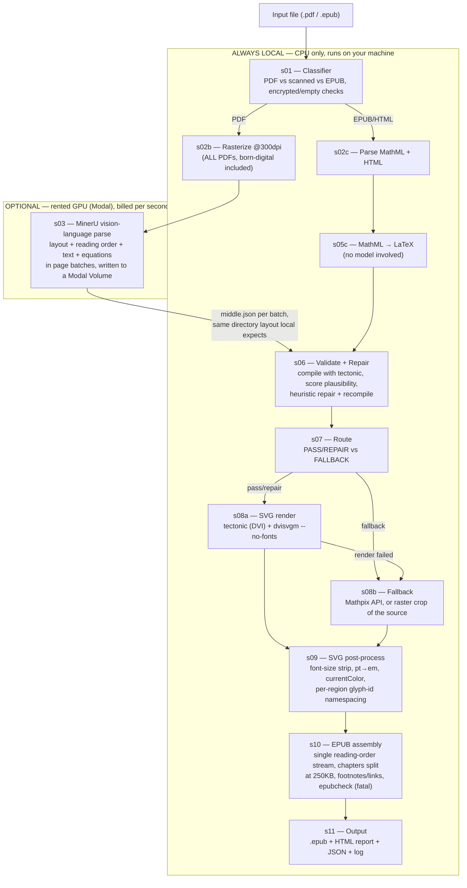

# Kindle Math Converter

Converts academic PDFs and EPUBs into Kindle-compatible EPUB3 files with
correctly rendered mathematical equations as scalable vector graphics (SVG).

License: [AGPL-3.0](LICENSE) — see
[License and third-party components](#10-license-and-third-party-components).

---

## Table of Contents

- [Architecture at a glance](#architecture-at-a-glance) — diagram, what makes
  this different from MinerU alone, and the local/remote split
0. [Quick start](#0-quick-start) — **start here for a normal book run**
1. [How it works — the short version](#1-how-it-works--the-short-version)
2. [System requirements](#2-system-requirements)
   - [Platform variations (non-Apple-Silicon hardware)](#2b-platform-variations-non-apple-silicon-hardware)
3. [Installation](#3-installation)
4. [Usage](#4-usage)
   - [Long documents (100+ pages)](#4b-long-documents-100-pages)
   - [Running the parse on a GPU](#running-the-parse-on-a-gpu)
   - [Verifying a parser change](#verifying-a-parser-change)
   - [Performance expectations by page count](#4c-performance-expectations-by-page-count)
5. [Understanding the output files](#5-understanding-the-output-files)
6. [Configuration reference](#6-configuration-reference)
   - [The tectonic LaTeX engine — what scientific users should expect](#the-tectonic-latex-engine--what-scientific-users-should-expect)
   - [Accuracy and reliability — what to expect](#accuracy-and-reliability--what-to-expect)
7. [The pipeline — what happens inside](#7-the-pipeline--what-happens-inside)
8. [Troubleshooting](#8-troubleshooting)
9. [Known limitations](#9-known-limitations)
10. [License and third-party components](#10-license-and-third-party-components)

---

## Architecture at a glance



**`s03` is the only stage that ever runs remotely, and only if you choose to
run it on Modal** — the `REMOTE` box above is the sole thing that moves; every
other stage, including the classifier and rasterizer that feed it, always
runs on your machine. If the parse is run locally instead (no `modal_app.py`
involved), `s03` runs inside the `LOCAL` box too — it's the same code either
way, just invoked from a different place; see
[Running the parse on a GPU](#running-the-parse-on-a-gpu). Everything except
`s03` never touches a GPU: tectonic, dvisvgm, poppler and epubcheck are CPU
subprocesses regardless of where the parse happened.

**What this adds on top of MinerU (or any layout-parser) alone.** MinerU
recovers layout and recognises equations as LaTeX, but stops there — it does
not know whether that LaTeX is *right*, and it has no opinion on Kindle's
rendering quirks. This project exists for what happens after MinerU's output:

- **A correctness gate MinerU doesn't have.** Every equation is compiled with
  a real LaTeX engine and scored for plausibility (Stage 6); wrong-but-close
  recognition gets a repair pass, and anything still broken falls back to a
  crop of the source rather than shipping broken or invisible math.
- **Equations rendered as scalable vector graphics, inline in the sentence**,
  not as images or raw LaTeX text — most PDF→EPUB tools do one of those two.
  SVGs scale with the reader's font size and respect Kindle's dark mode
  (Stage 9); a raster image doesn't do either.
- **Kindle-specific fixes no general-purpose EPUB tool applies**: the
  `dvisvgm --no-fonts` flag working around a font-corruption bug in KDP's
  conversion, per-equation glyph-id namespacing (duplicate SVG glyph ids fail
  KDP review), and a 250 KB hard split per chapter file (Kindle silently
  drops anything larger).
- **A regression harness for the parser itself** (`compare-snapshots`) that
  two speed optimizations already failed — see
  [Verifying a parser change](#verifying-a-parser-change).

**Configuration you need to have decided before running a book**, in the
order they matter:

1. Does the target machine have a usable GPU for MinerU? (Apple Silicon or an
   NVIDIA card — see [System requirements](#2-system-requirements)). If not,
   plan on the Modal remote parse.
2. If running remotely, has `modal setup` been done, and what
   `--batch-pages` will you use? That number **must** match
   `--parse-batch-size` on the local step — see
   [Running the parse on a GPU](#running-the-parse-on-a-gpu).
3. Is a Mathpix key available for equations that fail local recognition, or
   should those just fall back to a raster crop?
4. What body font size does the source document use (`--font-size`), so
   equation SVGs scale correctly against it?

---

## 0. Quick start

Everything needed to convert a book, assuming installation is already done.
Run all commands from the project root.

### A paper or short document

```bash
python main.py convert "path/to/paper.pdf" --output-dir ~/Desktop/KindleReads/Paper
```

The EPUB lands at `~/Desktop/KindleReads/Paper/{title}.epub`. A 6-page paper
takes about five minutes; a 14-page one about ten.

### A book (100+ pages) — parse on a GPU first

Parsing locally runs at ~45 s/page, so a 480-page book is a 6-hour parse. Renting
a GPU for that one stage turns it into ~30 minutes for well under a dollar. The
rest of the pipeline still runs on your machine.

**Step 1 — parse remotely. One book per command.**

```bash
BOOK=~/Desktop/KindleReads/Hartmann
modal run modal_app.py --pdf "path/to/book.pdf" --output-root "$BOOK" --batch-pages 250
```

**Step 2 — build the EPUB locally. Same directory, same batch size.**

```bash
python main.py convert "path/to/book.pdf" --output-dir "$BOOK" --parse-batch-size 250
```

`--parse-batch-size` **must** equal `--batch-pages` — those numbers are what the
batch directory names encode, and if they disagree the local run silently
re-parses the whole book itself at 45 s/page. Step 1 verifies its own output and
prints the exact step 2 command; copy that rather than retyping it.

### An EPUB or HTML file — no GPU step

```bash
python main.py convert "path/to/book.epub" --output-dir ~/Desktop/KindleReads/Book
```

Equations come straight from the file's own MathML (or the publisher's
embedded LaTeX, when present) — there is no MinerU parse to run, so this is
CPU-only and its speed doesn't depend on page count the way the PDF path
does. It scales with **equation count** instead: measured on a real
~2,200-equation publisher EPUB on a laptop CPU, end-to-end conversion took
~25 minutes, with Stage 6 (LaTeX compile + repair, one `tectonic` subprocess
per equation) accounting for ~24.5 of those minutes (~0.7s/equation) —
everything else (parsing, SVG rendering, assembly) combined is under a
minute. A short paper with a few dozen equations finishes in seconds.
See [Convert an EPUB or HTML file](#convert-an-epub-or-html-file) for details
and [Known limitations](#9-known-limitations) for what this path doesn't
handle yet (non-standard footnote markup, interactive/canvas content).

### Five things worth knowing

- **Re-running the local build (step 2) is cheap.** Completed batches and
  successful LaTeX compiles are cached under the output directory, so a second
  run skips both.
- **Re-running the remote parse (step 1) is not free of re-billing.** If a
  batch failed, running step 1 again does re-parse every batch on the GPU,
  including ones that already succeeded — there is no check against what's
  already on the Modal Volume before that. It fills in what's missing
  correctly, it just also re-pays for what wasn't missing. On a two-batch book
  where one batch failed, expect to pay for both batches again, not just the
  one that failed.
- **Confirm the parse was reused.** Step 2 should log `mineru_batch_reused`
  within its first seconds. If it logs `mineru_batch_start` instead, it is
  parsing locally — stop it and check the batch size matches.
- **Cost.** ~$1.30/hour on the default L4. A 500-page book is roughly $0.70.
  Set a spend limit in the Modal dashboard; nothing here enforces one.
- **GPU parses are not reproducible.** The same book parsed twice on a GPU gives
  ~2% different equations. Fine for reading, not for exact reproduction —
  see [Local runs are reproducible; GPU runs are not](#local-runs-are-reproducible-gpu-runs-are-not).
- **Everything is checked at the end.** `epubcheck` runs automatically and is
  fatal, so a completed run means a structurally valid EPUB.

---

## 1. How it works — the short version

Most PDF-to-Kindle converters break on math. They either skip equations entirely,
render them as blurry low-resolution images, or produce raw LaTeX text the Kindle
can't display.

This tool does four things differently:

1. **Reads** each page with a document vision-language model (MinerU), which
   recovers layout, reading order, text and equations in a single pass — including
   multi-column flow, headings, tables and footnotes.
2. **Recognises** every equation as LaTeX, inline ones included, keeping them in
   place inside their sentences rather than pulling them out as images.
3. **Validates** each equation by compiling it, and scores how plausible the
   recognised LaTeX is — equations that fail get a repair attempt, and anything
   still failing falls back to the page image rather than silently vanishing.
4. **Renders** each equation to SVG using a real LaTeX engine (tectonic + dvisvgm),
   and embeds it inline in the EPUB — so equations scale with font size, respect
   dark mode, and never appear blurry.

---

## 2. System requirements

- **Python 3.10 or later.**
- **~5 GB free disk space** for model weights and tools.
- **Internet connection** for the first run — both to download MinerU's model
  and for tectonic's own one-time font/package bundle download; see
  [The tectonic LaTeX engine](#the-tectonic-latex-engine--what-scientific-users-should-expect).
- **A GPU, effectively.** Details below — this is the requirement that decides
  whether the tool is usable on a given machine.

### The parse needs a GPU

MinerU is a vision-language model and it is ~95% of a long run's wall clock.
`-b vlm-engine` does not name an engine; it asks MinerU to pick one for the
platform, and the choice is what determines whether a book takes hours or weeks:

| Platform | Engine chosen | Runs on |
|---|---|---|
| **Apple Silicon**, macOS ≥ 13.5, `mlx-vlm` installed | `mlx-engine` | **the Apple GPU**, via Metal |
| **Linux** with `vllm` installed | `vllm-engine` | **a CUDA GPU** (required by vLLM) |
| Linux with `lmdeploy` instead | `lmdeploy-engine` | a CUDA GPU |
| **Anything else** — Intel Mac, Linux without either, missing extra | `transformers` | **CPU** |

The measured reference is **~45 s/page on an M4's GPU**. The `transformers` CPU
fallback is not a slower version of that. It has never been benchmarked here, but
this project's CPU-inference scoping (done while costing out AWS Lambda) put a
1000-page book at **38–126 hours** of CPU VLM time; halve that for 500 pages.
Treat that row as "does not work", not as "slow".

It is a quiet failure: MinerU falls back without erroring, so the first sign is
a run that never finishes. If a parse is running far slower than 45 s/page,
check which engine was selected before looking anywhere else.

**Practically:**

- **Apple Silicon Mac** — supported, no extra hardware. Install
  `mineru[vlm,mlx]`. This is what the project is developed and measured on.
- **Linux with an NVIDIA GPU** — supported. Install `mineru[vlm,vllm]`. Note
  recognition differs slightly from the Mac path and is not reproducible run to
  run; see [Local runs are reproducible; GPU runs are not](#local-runs-are-reproducible-gpu-runs-are-not).
- **Intel Mac, or any machine without a GPU** — the local parse is not viable.
  Rent the parse instead: see [Running the parse on a GPU](#running-the-parse-on-a-gpu).
  Everything after the parse (equation compiling, SVG rendering, EPUB assembly)
  is CPU work and runs fine anywhere.

The rest of the pipeline needs no GPU. tectonic, dvisvgm, poppler and epubcheck
are all CPU subprocesses.

### 2b. Platform variations (non-Apple-Silicon hardware)

The project is developed and measured on Apple Silicon; everything else below
is what's known to differ, not a full port checklist. Everything downstream of
the MinerU parse (Stages 5C–11: compiling, SVG rendering, EPUB assembly,
epubcheck) is plain CPU Python and subprocess calls, and needs nothing
platform-specific beyond the binaries in [Installation](#3-installation).

**Linux with an NVIDIA GPU (CUDA), compute capability ≥ 8.0**
- Install the `mineru[vlm,vllm]` extra instead of `mlx` (the requirements file
  selects this automatically by `sys_platform`).
- **Use `uv`, not `pip`**, to install `kindle_math_converter/requirements.txt`
  — pip cannot resolve the `vllm` branch of MinerU's dependency tree and
  backtracks indefinitely. See [Installation](#3-installation).
- Homebrew's `brew install tectonic dvisvgm poppler` doesn't apply. Install
  [tectonic](https://tectonic-typesetting.github.io/en-US/install.html)
  directly, and `apt install dvisvgm poppler-utils epubcheck` (or your
  distro's equivalent) for the rest.
- **Recognition output differs from the Mac path and is not run-to-run
  reproducible** — vLLM's batched execution reorders floating-point
  reductions between runs. This is a property of the CUDA path itself, not a
  configuration issue; see
  [Local runs are reproducible; GPU runs are not](#local-runs-are-reproducible-gpu-runs-are-not).
- `modal-requirements.txt` in the repo root is the fully-pinned, most-tested
  Linux x86_64 dependency set — it's what the Modal GPU image itself is built
  from — and is a safe fallback if the plain `requirements.txt` resolution
  gives trouble.
- **Never use a T4** for the parse, on Modal or otherwise: its compute
  capability (7.5) is below the 8.0 threshold at which MinerU enables custom
  logits processors, so it silently takes a different, unverified code path.

**Intel Mac, or any machine without a usable GPU**
- The local parse is not viable — MinerU's CPU fallback (`transformers`) has
  never been benchmarked in this project but was scoped at 38–126 CPU-hours
  per 1000 pages. Treat it as "does not work."
- Everything else in this project (tectonic, dvisvgm, poppler, epubcheck, the
  Python pipeline itself) is architecture-agnostic and installs the same way
  as on Apple Silicon.
- Rent the parse instead — see
  [Running the parse on a GPU](#running-the-parse-on-a-gpu). The local machine
  only needs the CPU-side toolchain; it never runs MinerU itself.

**Windows** — not tested, and nothing in this project has been adapted for
it. The installation steps assume Homebrew (macOS) or apt (Linux); a native
Windows install would need PowerShell equivalents for the binary installs and
is unverified. WSL2 with an NVIDIA GPU should behave like the Linux/CUDA path
above, but this has not been run or measured here.

---

## 3. Installation

Run these commands in order. Each step must complete without errors before
moving to the next.

### Step 1 — Install Homebrew (macOS package manager)

```bash
/bin/bash -c "$(curl -fsSL https://raw.githubusercontent.com/Homebrew/install/HEAD/install.sh)"
```

After it finishes, it prints a "Next steps" block. Run the two `eval` lines it
shows — they add `brew` to your PATH. Then verify:

```bash
brew --version
```

### Step 2 — Install system binaries

```bash
brew install tectonic dvisvgm poppler
```

Verify each one installed:

```bash
tectonic --version
dvisvgm --version
pdftoppm -v        # part of poppler
```

### Step 3 — Navigate to the project root

```bash
cd "Scientific Kindle Maker"
```

All subsequent commands are run from this directory.

### Step 4 — Create a virtual environment

```bash
python3 -m venv .venv
source .venv/bin/activate
```

### Step 5 — Install Python dependencies

```bash
pip install -r kindle_math_converter/requirements.txt
```

This takes a few minutes. If you see any red error lines, see
[Troubleshooting → Installation errors](#installation-errors).

The requirements file selects MinerU's platform extra for you —
`mineru[vlm,mlx]` on macOS, `mineru[vlm,vllm]` on Linux. **That extra is the
GPU backend**, and without it MinerU silently falls back to CPU inference that
is too slow to finish a book. See [System requirements](#2-system-requirements).

**On Linux, use `uv` instead of pip.** pip cannot resolve the `vllm` branch of
this dependency tree — it backtracks through cffi sdists indefinitely, with no
end observed after ten minutes. uv does it in about five seconds:

```bash
uv pip install -r kindle_math_converter/requirements.txt
```

There is also a fully-pinned Linux x86_64 set in the repo root,
`modal-requirements.txt` — it is what the Modal GPU image is built from and is
therefore the most-tested Linux dependency set in this project. macOS needs
none of this; the `mlx` branch resolves under plain pip in seconds.

Verify the right engine was installed:

```bash
python -c "from mineru.utils.engine_utils import get_vlm_engine; print(get_vlm_engine('auto'))"
```

Expect `mlx-engine` on an Apple Silicon Mac, or `vllm-engine` on Linux with an
NVIDIA GPU. If it prints `transformers`, the extra did not install — fix that
before converting anything.

> **Note on PyTorch.** Earlier versions of this guide told you to install a
> CPU-only build of torch first. Do not do that any more: on Linux it breaks
> vLLM, which needs the CUDA build. On Apple Silicon torch is only a transitive
> dependency — the model runs on MLX, not torch.

### Step 6 — Download AI model weights

```bash
python main.py download-models
```

This downloads MinerU's ~2.3 GB model (`opendatalab/MinerU2.5-Pro-2605-1.2B`)
and caches it in `~/.cache/huggingface/`. Subsequent runs skip the download.

The step is optional — the first `convert` downloads the model automatically.
Doing it separately just gets the wait out of the way.

If the download stalls (commonly on a VPN, which breaks HuggingFace's Xet
transfer protocol):

```bash
HF_HUB_DISABLE_XET=1 python main.py download-models
```

---

## 4. Usage

All commands are run from the `Scientific Kindle Maker/` directory.

### Convert a PDF

```bash
python main.py convert path/to/paper.pdf
```

### Convert an EPUB or HTML file

```bash
python main.py convert path/to/book.epub
python main.py convert path/to/chapter.html
```

Equations in these sources are read directly from the file's MathML (or, for
publisher-provided `<annotation encoding="application/x-tex">`, the original
LaTeX itself) — no MinerU parse needed, so this is CPU-only and fast
regardless of book length. A plain `.html` file is parsed as a single
chapter; an `.epub`'s own spine order becomes its chapter list.

### Common options

```bash
# Save output to a specific folder
python main.py convert paper.pdf --output-dir ./my_books

# See detailed per-equation logging while it runs
python main.py convert paper.pdf --verbose

# Open the HTML inspection report automatically when done
python main.py convert paper.pdf --open-report

# Lower the quality threshold (accept more equations as-is, fewer flagged)
python main.py convert paper.pdf --cdm-threshold 0.80

# Use a different body font size for SVG scaling (default is 12pt)
python main.py convert paper.pdf --font-size 11.0

# Skip epubcheck (if Java is not installed)
python main.py convert paper.pdf --no-epubcheck
```

### Full options reference

```
python main.py convert --help

Options:
  --output-dir PATH           Output directory.              [default: ./output]
  --verbose                   Detailed per-equation logging in terminal.
  --cdm-threshold FLOAT       Quality pass threshold (0–1).  [default: 0.88]
  --font-size FLOAT           Body font size in pt.          [default: 12.0]
  --mathpix-id TEXT           Mathpix App ID (optional fallback recogniser).
  --mathpix-key TEXT          Mathpix App Key.
  --open-report               Open HTML report in browser on completion.
  --dump-cache                Write cache contents to JSON for debugging.
  --no-epubcheck              Skip EPUB validation (if Java unavailable).
  --fresh-parse               Re-run MinerU even if a cached parse exists.
  --max-parallel-workers INT  Threads for per-equation work. [default: min(8, cpus)]
  --parse-batch-size INT      Pages per MinerU invocation.   [default: 50]
  --no-image-analysis         Skip MinerU's per-figure description pass
                               (loses figure alt text; no measured speed gain).
  --mineru-timeout INT        Per-batch timeout in seconds.  [default: derived]
```

There is also a second command for comparing runs — see
[Verifying a parser change](#verifying-a-parser-change):

```
python main.py compare-snapshots BASELINE.json CANDIDATE.json
```

### Re-download models

```bash
python main.py download-models

# Save to a custom location
python main.py download-models --models-dir /path/to/models
```

### Terminal summary after a successful run

```
Complete
  Source:     griffiths_em.pdf
  Output:     ./output/griffiths_em.epub
  Equations:  312 total
              287 passed  (92.0%)
               19 repaired (6.1%)
                4 fallback  (1.3%)
                2 flagged   (0.6%)
  Cache:       89 hits / 223 misses (28.5% hit rate)
  Duration:    4m 22s
  Report:     ./output/griffiths_em_report.html
```

If any equations are flagged:
```
  ⚠  2 equations could not be rendered.
     Open the report and review: ./output/griffiths_em_report.html
```

---

## 4b. Long documents (100+ pages)

MinerU is roughly 86% of a short run's wall clock and ~95% of a long one, at a
measured **45 seconds per page**. A 500-page textbook is therefore a 6–7 hour
parse. Three things make that survivable rather than merely slow.

**The parse runs in batches and resumes.** Pages are parsed
`--parse-batch-size` at a time (default 50), each batch into its own directory
under `<output>/mineru/batch_XXXXX_XXXXX/` with its own cached result. If a run
dies at page 480, re-running it reuses every completed batch and only redoes the
one that failed — minutes lost instead of hours. Nothing special is needed to
resume: just run the same command again.

**Timeouts scale with the work.** Each batch gets `pages × 120s` (minimum 600s)
rather than one fixed cap, because a 6-page paper and a 500-page textbook cannot
share a sensible constant. Override with `--mineru-timeout` if you need to.

**Memory is bounded by batch size, not book length.** Page rasters are written
to a temp directory and encoded one at a time, and each page's raster is
released as soon as its equation crops are cut. Peak resident memory on a
500-page book is ~0.44 GB. (Before this was measured and fixed it was 6.64 GB,
which does not fit on a 16 GB machine.)

A practical note: iterating on a long book is much cheaper than the first run.
Successful LaTeX compiles are cached in `<output>/.compile_cache/`, so a second
run of the same book skips the equation work entirely — measured at 79s → 14s on
the 6-page reference paper.

### Verifying a parser change

Every run writes `{title}_latex_snapshot.json` containing the recognised LaTeX
for every equation. `compare-snapshots` diffs two of them exactly:

```bash
python main.py compare-snapshots old/book_latex_snapshot.json new/book_latex_snapshot.json
```

Exit code 0 means recognition is unchanged; 1 means review it before accepting.

**This exists because equation counts are not a sufficient check.** The quality
gate is "does it compile, and does it look plausible" — so an equation that is
recognised *wrongly* but still compiles passes silently, and at a thousand
equations nobody finds it by reading. Two optimisations were measured against
this harness and both were rejected despite being faster and producing zero
flagged equations and a clean EPUBCheck:

| Change | Speed | What the diff found |
|---|---|---|
| `-b hybrid-engine --effort medium` | 15% faster | 37% of equations changed. `SU_{3}` became `^{3}`; footnote markers shifted by one. |
| 8-bit MLX quantization of the model | 21% faster | 3% changed — including a commutator `\left[ … \right]` turned into a ceiling function `\lceil … \rceil`. |

A third, `--image-analysis false`, left recognition identical but produced no
measurable speedup, and it drops the figure descriptions used as alt text.

The conclusion: **there is no local speed win available that does not cost
correctness.** The real bottleneck is that `mlx-vlm` cannot batch — it predicts
one region at a time — and that is upstream, with no configuration knob. If the
6–7 hours matters, the answer is to run MinerU somewhere with a batching GPU,
not to tune it locally.

### Running the parse on a GPU

`modal_app.py` runs the MinerU stage on a rented GPU and brings the result back.
It is deliberately standalone: it imports nothing from `kindle_math_converter`,
nothing imports it, and deleting the file returns the project to a purely local
tool. Requires a Modal account (`pip install modal && modal setup`).

```bash
modal run modal_app.py --pdf "path/to/book.pdf" \
    --output-root ~/Desktop/KindleReads/Book --batch-pages 250
```

**`--output-root` is the pipeline's `--output-dir`.** The results are written
into the exact layout `s03` looks for, so the local run finds the parse and skips
MinerU with nothing to move by hand:

```
<output-dir>/mineru/batch_00000_00249/<stem>/vlm/<stem>_middle.json
<output-dir>/mineru/batch_00250_00480/<stem>/vlm/<stem>_middle.json
```

Whole-document parses (no `--batch-pages`) are written as
`<output-dir>/mineru/<stem>/vlm/…` instead, which `s03` also reads.

**The batch sizes must match.** A directory name encodes the page range it holds,
and `s03` re-bases each batch's page numbers by the offset that name carries. Two
consequences, both important:

- Give the local run a *different* `--parse-batch-size` and it looks for
  directories that do not exist, finds nothing, and re-parses the entire book
  locally — hours, with no error, presenting only as slowness. The remote run
  therefore re-derives the expected directory list from the page count, checks
  what it actually wrote, and prints the matching local command.
- Assembling these directories by hand is how a batch's equations end up attached
  to another batch's pages. That is why the runner writes them itself.

**One book per invocation, in this layout.** Directories are keyed on page range
alone, so a second book — or a second parse of the same book — would land on top
of the first. `--repeat` and `--pages` are refused here for the same reason, and
`--repeat` most of all: its only purpose is giving `compare-snapshots` a second
parse to diff, and if the second overwrote the first, that check would compare a
file with itself and report "identical" forever. Use `--layout labelled` for
those, which writes one directory per job and expects you to place the results
yourself.

Failed batches are not fatal in the sense that a re-run will eventually produce
a complete parse — but the remote runner does not currently check the Modal
Volume before re-invoking `mineru` on a batch that already succeeded there. A
retry re-parses (and re-bills) every batch in the command, not just the one
that failed. The fix — skip a batch whose result is already committed to the
Volume — is designed but not yet built; the local step (`s03`) does have this
resumability, which is why step 2 stays cheap to re-run.

### How much GPU memory the engine gets

MinerU runs vLLM at `gpu_memory_utilization=0.5` — half the card, whatever the
card is. On a 23 GiB L4 that budgets ~11.25 GiB, and the engine spends almost
all of it before caching anything: 2.16 GiB of model weights plus what vLLM
calls its activation/profiling peak, sized from `max_model_len` and the
config's maximum feature size — **not from the pages of the document in front
of it**. Two consequences that are easy to get backwards: parsing fewer pages
per batch does not help (the peak is per-engine, not per-batch), and a denser
or higher-resolution book does not make it worse.

**A first fix derived the fraction from measured free memory at run time, and
it did not hold up.** One run measured 22.0 GiB free, derived a fraction, and
completed with 13.46 GiB of KV cache to spare. The exact same derivation, on
the exact same book and page range, with nvidia-smi again reporting 22.0 GiB
free, then produced −0.92 GiB and failed. Fixed cost — everything vLLM needs
before any KV cache exists — measured 7.0 GiB on the run that worked and
21.4 GiB on the one that didn't, a 3× swing with no observable difference in
the inputs. This vLLM build does not print the internal breakdown that would
name which term varies, so the mechanism stays unconfirmed; what's confirmed
is that nvidia-smi's externally visible "free" number cannot predict it.

**So this is now a small fixed ladder, not a derivation.** Two rungs, tried in
order: `0.70`, then `0.55` if that specific failure recurs. Real headroom below
even the worst fixed cost observed so far (21.4 of 23 GiB), on the strength of
what Frankel already proved: the parse only needs ~0.5 GiB of actual KV cache
to complete a real book, so a fixed value with slack beats a clever prediction
that has now failed twice on identical inputs. Lower rungs are plausibly not
just more headroom but a lower fixed cost too — vLLM chooses how many CUDA-graph
shapes to capture from the budget it's given, so a smaller ask may mean a
smaller graph pool, not just a smaller request. Consistent with the run at 0.50
needing only 10.74 GiB fixed cost against the failed run's 21.4 at 0.891 —
suggestive, not proven.

**The retry is targeted, not blind.** Only the specific error vLLM raises for
this condition — `No available memory for the cache blocks` — triggers the next
rung. A stall, a crash, anything else stops there; the ladder is not a general
retry-on-any-failure mechanism. And before spending a subprocess launch on a
rung, a coarse check asks whether the card can plainly supply it: if the rung's
request exceeds what's measured free right now, minus a small safety margin,
it's skipped without launching mineru. This is a floor, not a projection — a
precise-looking projection is exactly what failed twice; the fix is not a
smarter prediction, it's a targeted retry backed by evidence a rung is
literally impossible before spending money to confirm it.

Override with `--gpu-mem-util 0.85` to pin a single value with no ladder — that
is the point of overriding it.

**What's proven and what isn't, after 4 real batches on 2 real books**
(2026-08-14/15): every one succeeded on **rung 1**, at an identical 11.74 GiB
of KV cache each time. Rung 2 has never fired. Read that precisely:

- **Proven:** a small fixed value (0.70) reliably clears whatever the earlier
  failures hit — 4/4, not a guess holding up so far.
- **Not proven:** the retry itself. Zero exercised evidence either way for
  whether rung 2 would rescue an actual rung-1 failure.
- **Not true:** "the fix wasn't needed." MinerU's raw 0.5 default failed on
  the very first real attempt, before any of this existed. The derived value
  in between (~0.89) also failed, twice, unpredictably. Only 0.70-fixed has
  held.

**Why fixed cost swings 7 → 21 GiB on identical inputs is still an open
question**, not a solved one. Two hypotheses, not distinguished by anything
collected so far: Modal host/hardware heterogeneity (different physical L4s,
or the same one under different neighbour load), or vLLM/CUDA-graph internal
nondeterminism in how its profiling step scales graph-capture range with the
budget it's given. What would settle it — vLLM's own memory decomposition
(`peak_torch_memory`, `non_torch_memory`, etc.) — was invisible before: it is
logged at DEBUG in vLLM's source, and the image never set a logging level. It
now does; see below.

**Downstream effects, since this is not only a reliability setting:**

- **Throughput and cost.** A smaller KV cache than the derivation would have
  given means fewer concurrent sequences, so the expected effect is somewhat
  slower per rung actually used. Unmeasured against the ladder; the baseline is
  2.6 s/page from Frankel's original 0.5 run.
- **Recognition output.** GPU parses are already non-reproducible because batch
  composition changes the order of floating-point reductions; KV cache size
  changes how requests get batched, so **which rung a job lands on changes
  which equations come back**. Not worse, but a snapshot from one rung isn't a
  fair baseline for another. Every attempt — including skipped and failed
  rungs — is recorded per job under `gpu_mem_attempts` in
  `<output-root>/_run_logs/<timestamp>/remote_run_summary.json`, for exactly
  this reason. See [Verifying a parser change](#verifying-a-parser-change).
- **Failure cost.** A rung that's tried and fails costs real GPU time (~190 s
  observed) before the next one starts; a rung that's skipped by the free-memory
  check costs nothing.

### What gets logged, and why it has to be captured here

**Modal's own log retention is short and not something to rely on.**
Confirmed 2026-08-15: `modal app logs` returns at most the last 100 entries
(`modal app logs --help` says so outright), and `modal app list` had already
stopped listing two apps involved in a real incident less than 24 hours after
it happened. The web dashboard is reported to keep roughly a day. If something
worth investigating happens on a run, Modal's side of the record is gone
within about a day whether or not anyone looked.

So every run writes its own durable, timestamped archive —
`<output-root>/_run_logs/<UTC-timestamp>-<random>/` — holding
`remote_run_summary.json` and one full, untruncated `<label>.log` per job.
Timestamped rather than fixed-path on purpose: a fixed path meant a retry
against the same book (the ordinary case right after any failure) silently
overwrote the previous attempt's summary, which is how a real incident on this
project briefly lost its own evidence a few hours before someone tried to
write it up. The directory name adds a random suffix on top of the timestamp,
since two runs launched within the same second would otherwise collide too —
found by testing this specific scenario, not by inspection.

What's captured, so a hardware anomaly can actually be escalated rather than
just described:

- **`VLLM_LOGGING_LEVEL=DEBUG`**, set in the image. vLLM's own memory
  decomposition is logged at DEBUG, not INFO — without this, the one line that
  would name which internal term is responsible for a memory failure never
  reached the log at all. Costs more log text, not more compute.
- **GPU UUID**, not just model name and driver version — the one field that
  can prove or disprove "was this the same physical card" across two runs with
  otherwise-identical readings.
- **Modal's own container identifiers** — `MODAL_TASK_ID`, `MODAL_CLOUD_PROVIDER`,
  `MODAL_REGION`, `MODAL_IMAGE_ID` — set automatically in every container
  (confirmed against Modal's docs). The difference between "this GPU model
  sometimes misbehaves" and something Modal support can actually look up.
- **Every ladder rung's full output**, not just the last one tried. A job that
  fails rung 1 and succeeds on rung 2 used to discard rung 1's traceback
  entirely — the attempt most likely to be interesting.

### Working out what a GPU run costs

> **Rates below were captured on 2026-08-12 and verified against one real
> invoice on that date. Cloud pricing moves — re-check
> <https://modal.com/pricing> before relying on these figures, and treat any
> estimate derived from them as stale after a few months.**

Cost is **not** just the GPU rate. Modal bills the GPU, the CPU cores you request,
and the memory you request, for every second the container is alive:

```
$/second = gpu_rate + (cpu_cores x 0.0000131) + (memory_GiB x 0.00000222)
```

GPU rates per second (as of 2026-08-12): T4 `0.000164`, L4 `0.000222`,
A10G `0.000306`, L40S `0.000542`, A100-40GB `0.000583`, A100-80GB `0.000694`,
H100 `0.001097`.

**Requested CPU and memory are a large share of the bill** — not a rounding error.
For L4 with 8 cores and 16 GiB they are 39% of the total. Sizing them by
guesswork wastes real money:

| Configuration | $/hour |
|---|---|
| L4 + 2 cores + 8 GiB | $0.96 |
| L4 + 4 cores + 8 GiB | $1.05 |
| L4 + 8 cores + 16 GiB | $1.30 |
| A10G + 8 cores + 16 GiB | $1.61 |
| L40S + 8 cores + 16 GiB | $2.46 |

*(rate card current as of 2026-08-12)*

**What counts as billable seconds:** from container start until the function
returns. Local upload and download time is not billed. Idle time *is* billed —
`scaledown_window` keeps a container alive after its last input and defaults to
**60 seconds**, which you pay for. `modal run` uses an ephemeral app that is torn
down when the entrypoint exits, so it avoids that tail; a deployed function does
not, and should set `scaledown_window` low.

Verified against a real invoice: an L4 + 8 core + 16 GiB run with 529 s of work
billed 552 s and cost **$0.20**, matching the formula to within 4%.

Practical figures at the measured ~3.5 s/page:

| Book | Parse | Cost (L4 + 8 + 16) |
|---|---|---|
| 500 pages | ~32 min | ~$0.70 |
| 1000 pages | ~63 min | ~$1.35 |

### Choosing GPU, CPU and memory (measured 2026-08-12)

Two configurations were measured on the same document, two parses each:

| Config | $/hr | mean s/page | spread | parse cost per 1000 pp |
|---|---|---|---|---|
| **L4 + 8 cores + 16 GiB** | 1.30 | 4.1 | **1.05x** | $1.49 |
| L4 + 4 cores + 8 GiB | 1.05 | 4.8 | 1.71x | $1.39 |

**Use 8 cores and 16 GiB — the decision is reliability, not price.** Halving
them saves about 7% on the parse, which on a 1000-page book is roughly ten
cents. In exchange, two identical parses came back 1.7x apart instead of 1.05x.
Unpredictable throughput is not just annoying: it is what makes a long run's
duration and cost unquotable, and it is the problem that started this whole
investigation. A dime is not worth reintroducing it.

**This experiment was flawed — treat the result as a weak signal, not a
finding.** Three problems, in order of severity:

1. **Two variables moved at once.** CPU went 8 → 4 *and* memory 16 → 8 GiB, so
   neither can be credited. The more plausible mechanism is actually memory:
   8 GiB leaves little page cache for a 2.2 GB model plus 300 dpi page rasters,
   so the slow parse may have been re-reading from the network-backed Volume.
2. **Two parses per configuration.** Far too few to separate a real effect from
   ordinary noise.
3. **The runs landed on different host classes** (24 cores/381 GB versus
   20/190). Those are the *physical host*, not our slice — `cpu=` and `memory=`
   are reservations — but a core is not a fixed unit of speed across CPU
   generations, and neighbours contend for memory bandwidth and the PCIe path to
   the GPU.

Keeping 8 cores and 16 GiB is the conservative call, not a proven optimum. To
settle it: change one variable at a time, repeat within a single container (jobs
in one container share hardware, which controls for placement), and pin
`region=` so the hardware pool is narrower.

### What varies between runs, and what to do about it

Modal schedules onto whatever worker is free across its fleet, so host specs
differ run to run. What this means in practice:

| Factor | Under your control? | How |
|---|---|---|
| Your CPU/memory slice | **Yes** — it is a reservation | `cpu=`, `memory=` |
| Host CPU generation | In principle | `region=`/`cloud=` — **but see below** |
| Noisy neighbours | No | repeat measurements; compare within one container |
| Engine init cost | **Yes** | larger page batches amortise it |

**Region pinning is deliberately not used.** Modal charges **1.5–1.75x base
prices** for region selection, which would take this configuration from $1.30/hr
to $1.95–2.28/hr. That is a 50–75% surcharge to narrow a spread that was never
isolated in the first place.

It is also largely unnecessary. `cpu=` and `memory=` are *reservations* — your
slice is the same whichever host you land on — and `gpu=` pins the accelerator
model. What the host still influences is second-order: which CPU generation
those cores belong to, and contention with neighbours for memory bandwidth, the
PCIe path to the GPU, and the network path to the Volume. Let Modal place the
work wherever it likes and pay base rates.

The runner logs `affinity_cpus` and the cgroup CPU/memory limits — the
allocation itself — alongside the host CPU model. An earlier version logged only
`os.cpu_count()` and `/proc/meminfo`, which describe the host and say nothing
about your slice; that is what made the first timing differences impossible to
attribute.

GPU choice is firmer. L4 matched A10G's best observed throughput at 27% lower
cost, so A10G buys nothing here. **Do not use T4** at any price: its compute
capability is 7.5, below the 8.0 threshold at which MinerU enables custom logits
processors, so it silently takes a different code path and changes recognition.

The larger lever is **batch size, not resources.** Engine startup costs 69–145 s
per `mineru` invocation, so it dominates short jobs and vanishes on long ones —
on a 6-page paper it is most of the run; across a 250-page batch it adds ~7%.
Prefer large page batches, bounded by how much work you are willing to redo if
one fails.

### Detecting a stuck remote parse

A wall-clock timeout is the wrong instrument for this: short enough to catch a
hang quickly and it kills a legitimately long book; long enough for 1000 pages
and a hang burns hours of rented GPU first.

So the remote runner watches **progress**, not elapsed time and not merely
output. MinerU prints a tqdm counter (`94/197`), and the watchdog requires that
counter to *advance*. This matters because a process can keep printing while the
work behind it is wedged — a redrawing bar or a heartbeat log is
indistinguishable from progress unless you read the number. Silence is only the
easy case.

Before any counter exists (engine startup prints plenty and counts nothing) it
falls back to time-since-output, which is the right measure for that phase. A
health line every 60 s reports the current counter and seconds since it last
moved. The function timeout remains only as a backstop that should never fire.

Consequence: a 700-page book that wedges at page 562 costs one stall window,
not the remainder of the run — and batches already committed survive it.

### Local runs are reproducible; GPU runs are not

Running the same document twice locally produces identical output. The Apple
Silicon path (`mlx-engine`) predicts one region at a time, and MinerU requests
greedy decoding (`temperature=0.0, top_k=1`), so the result is deterministic.

**A CUDA GPU running `vllm-engine` is not deterministic — and this isn't only
about equation content.** Measured on the same PDF, same pinned package set,
same model, in the same container, two consecutive runs: **152 equations
detected on one run, 153 on the other, with 2 changed.** The count itself
moved, not just the recognised LaTeX for a fixed set of equations — meaning
MinerU's page-region partitioning is itself part of what's non-deterministic
on this backend, not only the token-level recognition inside an already-fixed
region. This is not a sampling setting that can be corrected — MinerU already
requests greedy decoding on every backend (`temperature=0.0, top_k=1`,
confirmed in `mineru_vl_utils`). It is a property of vLLM's batched execution:
batch composition changes the order of floating-point reductions, so
identical greedy requests can resolve to different tokens — and, downstream
of that, different region boundaries — depending on how the scheduler grouped
them.

Practical consequences:

- Converting the same book twice on a GPU yields two slightly different EPUBs.
  For reading a book once, this does not matter. For reproducing someone else's
  output exactly, it cannot be relied upon — pinning package versions does not
  make it reproducible.
- Snapshot comparison against a GPU-produced baseline carries ~2% noise. Treat
  small diffs as inconclusive rather than as a regression.

Design around it rather than trying to fix it.

### 4c. Performance expectations by page count

Two numbers dominate everything else: the MinerU parse (~95% of a long run's
wall clock) and, downstream of it, equation compiling at roughly 0.6 s per
equation reaching tectonic. The table below is the parse alone, local vs.
remote, at the measured reference rates elsewhere in this document
(**45 s/page** local on an M4's GPU; **~3.5 s/page** remote on Modal's default
L4 + 8 cores + 16 GiB, which includes vLLM's ~70–145 s per-invocation init
cost amortised over the batch).

| Pages | Local parse only (Apple Silicon GPU) | Remote parse only (Modal, L4+8+16) | Remote cost |
|---|---|---|---|
| 6 (short paper) | *whole pipeline ~5 min, measured — parse dominates but isn't isolated at this size* | not worth renting — see below | — |
| 100 | ~75 min | ~7 min | ~$0.15 |
| 250 | ~3.1 hr | ~16 min | ~$0.35 |
| 500 | ~6.25 hr | ~32 min *(measured)* | ~$0.70 *(measured)* |
| 1000 | ~12.5 hr | ~63 min *(measured)* | ~$1.35 *(measured)* |

*100/250-page figures are derived from the 3.5 s/page rate this project uses
for per-book cost planning, plus the measured per-invocation init overhead
(~19% on a 100-page batch, ~7% on a 250-page batch); the 500/1000-page rows
are measured end to end. Note this project's own dedicated 8-core/16GiB
throughput measurement came in higher, at 4.1 s/page — so treat the 100/250
rows as ~15% optimistic against that stricter number, not as a bound. Costs
use the rate card in
[Working out what a GPU run costs](#working-out-what-a-gpu-run-costs) and are
stale if Modal's pricing has moved — re-check <https://modal.com/pricing>.*

**Rule of thumb:** under ~50 pages, local parsing is usually faster once you
count uploading the PDF and the ~70–145 s Modal container/engine startup; for
anything past a hundred pages or so, renting the GPU is both faster in wall
clock and, per the numbers above, inexpensive. Equation compiling and SVG
rendering (everything after the parse) run at the same speed either way,
since they're always local CPU work — add roughly a few minutes for a
few-hundred-equation book, more for equation-dense textbooks.

---

## 5. Understanding the output files

Every conversion produces five files in the output directory
(default `./output/`):

### `{title}.epub`

The converted book. Send this to your Kindle via the
[Send to Kindle](https://www.amazon.com/sendtokindle) website or app.
Amazon converts it to their internal KFX format automatically.

### `{title}_report.html`

Open this in any browser. It contains:

- A summary table of every pipeline stage (duration, status, any errors).
- A searchable, sortable table of every equation in the document showing:
  - The source image crop, for equations that did not pass cleanly. Crops are
    ~20–100 KB each, so embedding one per equation would make a large book's
    report hundreds of megabytes; equations that passed the gate show a note
    instead.
  - The recognised LaTeX.
  - The CDM quality score (how closely the rendered SVG matches the original).
  - The confidence gate: **pass**, **repaired**, **fallback**, or **flagged**.
- For flagged equations: the source crop and raw LaTeX so you can correct them manually.
- The full error log.

Use this file to diagnose any quality issues.

### `{title}_result.json`

Machine-readable summary of the pipeline run — useful if you want to script
batch processing or check results programmatically.

### `{title}_latex_snapshot.json`

The recognised LaTeX for every equation, keyed by page and reading order. Used
by `compare-snapshots` to prove a parser change did not alter recognition — see
[Verifying a parser change](#verifying-a-parser-change). Also useful on its own
for grepping what the recogniser actually produced for a given equation.

### `{title}_pipeline.log`

Newline-delimited JSON log. Every stage start/end and every equation event is
recorded here with timestamps. Appended to (not overwritten) on re-runs
against the same output directory, so this survives to be checked weeks
later even if the book gets reprocessed in the meantime — each run is
delimited by its own `run_start` event with a `run_id`. Pass `--verbose` to
also echo these JSON lines to the terminal as they happen; without it, the
terminal only shows a progress spinner and the final summary (an unexpected,
unclassified failure still prints a full traceback to the terminal
regardless of `--verbose`).

---

## 6. Configuration reference

### Quality threshold (`--cdm-threshold`)

The CDM score is a measure of how closely the rendered SVG matches the source
equation image. It ranges from 0 (completely wrong) to 1 (pixel-perfect).

| Score | What happens |
|---|---|
| ≥ threshold (default 0.88) | Equation passes as-is |
| threshold − 0.18 to threshold | Repair attempted (common transcription errors fixed) |
| Below repair threshold | Sent to fallback (Mathpix if configured, otherwise flagged) |

**Raise the threshold** (e.g. `--cdm-threshold 0.92`) if you need higher
accuracy and don't mind more equations being flagged.

**Lower the threshold** (e.g. `--cdm-threshold 0.78`) if too many equations
are being flagged and the results look visually correct anyway.

### Font size (`--font-size`)

SVG equation dimensions are expressed in `em` units so they scale when the
Kindle user adjusts font size. The conversion uses the body font size in points
as the divisor. Most books use 10pt or 11pt body text. If equations appear
too large or small on the Kindle, adjust this value.

### Mathpix fallback (optional)

Mathpix is a commercial API for equation recognition. If configured, equations
that fail the local pipeline are sent to Mathpix instead of being flagged.

```bash
export MATHPIX_APP_ID=your_app_id
export MATHPIX_APP_KEY=your_app_key
python main.py convert paper.pdf
```

Or pass them directly:

```bash
python main.py convert paper.pdf --mathpix-id your_id --mathpix-key your_key
```

### Model weights location

MinerU's model is fetched by `huggingface_hub` and lives in its standard cache,
`~/.cache/huggingface/` (~2.3 GB). Relocate it the usual way:

```bash
export HF_HOME=/Volumes/ExternalDrive/huggingface
python main.py download-models
```

To point MinerU at a *different* model (a quantized build, say), set
`MINERU_MODEL_SOURCE=local` and add `models-dir.vlm` to `~/mineru.json`. Back
that file up first — MinerU rewrites it.

### The tectonic LaTeX engine — what scientific users should expect

Every equation is compiled by [tectonic](https://tectonic-typesetting.github.io/),
a self-contained TeX engine — not a full TeX Live install, and not the
document's original LaTeX preamble. Each equation is wrapped standalone in its
own minimal document before compiling, so what your source PDF's preamble
does (custom macros, `\newcommand`, unusual packages) is invisible to it. Two
consequences worth setting expectations around:

- **A fixed, small package set**, not your document's own preamble:
  `amsmath`, `amssymb`, `amsfonts`, `physics`, plus `braket` auto-added when
  `\bra`/`\ket`/`\braket` is detected in the equation. Equations built from
  these — which covers the overwhelming majority of physics, math and
  engineering notation — compile cleanly. An equation that depends on a macro
  defined only in the source document's own preamble (a custom operator, a
  redefined symbol) will not resolve and falls through the quality gate to a
  raster crop of the original — not silently dropped, just not vector.
- **Font encoding is deliberately forced to Computer Modern via `[OT1]{fontenc}`**,
  not tectonic's default (Latin Modern). Latin Modern ships only as `.otf` in
  tectonic's bundle, which `dvisvgm` cannot embed — every equation containing
  `\text{...}` failed until this was fixed. The tradeoff: OT1 has no non-ASCII
  glyphs, so non-ASCII characters inside `\text{}` (e.g. accented author names
  in a caption-style equation) can still fail to render and fall back to a
  raster crop.

**tectonic has its own first-run download, separate from the MinerU model.**
It fetches its font/package bundle on first use and caches it under
`~/Library/Caches/Tectonic` (macOS) or `~/.cache/Tectonic` (Linux) —
automatic, and only once. This is a second reason the "internet connection
for the first run" requirement in [System requirements](#2-system-requirements)
applies: it isn't only the MinerU model download.

**Rendering, not typesetting fidelity, is the target.** The pipeline uses
tectonic's compile step as a *correctness check* (does this LaTeX compile,
does it look plausible) and its SVG output as the *artifact* — it is not
attempting to reproduce the source document's exact typographic choices
(different math font packages, custom operator spacing). If a book's
equations rely on packages outside `amsmath`/`amssymb`/`amsfonts`/`physics`/`braket`,
expect more equations in the flagged/fallback tier — see
[Known limitations](#9-known-limitations).

### Accuracy and reliability — what to expect

Two things are worth setting expectations on before trusting output for real
scientific reading, neither of which is a bug in this pipeline — they're
properties of the technology it's built on.

**Some equations will be recognised wrong, and the pipeline cannot always
tell.** The quality gate is *"does this LaTeX compile, and does its shape
look plausible against the source crop"* — never a direct visual comparison
against the original equation. An equation recognised incorrectly but that
still happens to compile and look plausible **passes silently**. Measured
against ground truth on a real corpus, both the local (`mlx-engine`) and
remote (`vllm-engine`) MinerU backends sit near **98.7% accuracy**, with
partially non-overlapping error sets — remote is a peer, not a downgrade,
but neither is exact. On a thousand-equation book, that's on the order of a
dozen quiet errors. `compare-snapshots` catches *changes* in recognition
between two runs; it does not catch *errors* present in both. See
[Known limitations](#9-known-limitations) for the accepted-gap writeup.

**Don't expect byte-for-byte reproducibility from any GPU-backed parse —
local Apple Silicon is the only deterministic path.** Both a rented Modal GPU
and a local Linux/CUDA machine run MinerU's `vllm-engine`, and vLLM's batched
execution reorders floating-point reductions between runs regardless of where
it's hosted. This isn't limited to a few tokens changing inside an otherwise
fixed set of equations — one measured pair of consecutive runs on the same
PDF, same container, same everything, found the *equation count itself*
moved (152 → 153), meaning MinerU's page-region partitioning is part of what
varies, not only the LaTeX recognised inside an already-agreed-upon region.
See [Local runs are reproducible; GPU runs are not](#local-runs-are-reproducible-gpu-runs-are-not)
for the full measurement and what it means for snapshot comparisons and for
reproducing someone else's exact output.

---

## 7. The pipeline — what happens inside

Understanding the stages helps interpret the HTML report and diagnose problems.

```
Input file
    │
    ▼
Stage 1 — Classifier
    Reads the file and determines: is this a LaTeX PDF, a scanned PDF, an
    EPUB, or HTML? Detects math fonts, scanned pages, column layout.
    ► Fatal if the file is encrypted, empty, or unrecognised format.
    │
    ▼
Stage 2 — Extraction  (two variants)
    2B PDF:        Rasterises every page to a 300 DPI image, written to a
                   temp directory and decoded one at a time. ALL PDFs take
                   this path — born-digital ones included.
    2C EPUB/HTML:  Walks the document (EPUB: each spine item in order; HTML:
                   the one file) and builds prose, headings, lists, tables,
                   figures and footnotes directly from the markup — plus
                   equations from <math> (MathML) and equation-like 
                   elements, both with placeholders spliced into the
                   surrounding text exactly like Stage 3 does for PDFs.
    │
    ▼
Stage 3 — MinerU parse  (PDF only)
    One vision-language pass over the pages, as a subprocess, in batches of
    --parse-batch-size. Recovers layout, reading order, body text, tables,
    figures and equations together — inline equations stay in place inside
    their sentences as [[EQ:id]] placeholders. Footnotes are recovered from
    MinerU's discarded blocks. Equation crops are re-cut from the Stage 2B
    raster.
    Reuses any parse already on disk, which is what makes a GPU-parsed book
    and a resumed run both work.
    ► Fatal if a batch fails; completed batches survive for the re-run.
    │
    ▼
Stage 5C — MathML conversion  (EPUB/HTML only)
    Converts MathML to LaTeX directly — no model involved. Publisher-provided
    <annotation encoding="application/x-tex"> is used verbatim when present;
    otherwise LaTeX is derived from the presentation MathML tree. Equations
    that still fail to compile fall back to plain text built from the
    MathML's own tokens, rather than being dropped (EPUB/HTML sources have
    no page raster to crop an image fallback from, unlike PDFs).
    │
    ▼
Stage 6 — Validation and Repair
    For each equation:
      1. Compiles the LaTeX with tectonic, retaining the compiled XDV so
         Stage 8A does not have to compile it a second time.
      2. Scores whether the result is plausible (it compiles, and its shape
         is consistent with the source region).
      3. If it fails, applies heuristic repair rules and recompiles.
      4. Assigns a confidence gate: PASS, REPAIR, FALLBACK, or FLAGGED.
    Runs in parallel, with a sequential retry pass for anything that timed
    out under contention.
    │
    ▼
Stage 7 — Routing
    Splits equations into two groups:
    PASS/REPAIR → Stage 8A (local SVG rendering)
    FALLBACK    → Stage 8B (Mathpix API or flag for review)
    │
    ▼
Stage 8A — SVG Rendering
    Compiles each passing equation with tectonic (→ DVI format).
    Converts DVI to SVG with dvisvgm using --no-fonts (critical: prevents
    a known Kindle rendering bug where font sizes get corrupted).
    Checks the session cache first — identical equations skip rendering.
    ► Failed equations routed to Stage 8B.
    │
    ▼
Stage 8B — Fallback
    If Mathpix is configured: sends the equation image to Mathpix API.
    Otherwise: embeds the equation's crop from the page raster as an image,
    so a failed recognition degrades to a picture of the real equation
    rather than to a placeholder.
    │
    ▼
Stage 9 — SVG Post-Processing
    Applies five Kindle-specific fixes to every SVG:
    1. Removes font-size declarations (prevents KDP px→rem corruption).
    2. Converts dimensions from pt to em (scales with Kindle font size).
    3. Replaces fill="black" with fill="currentColor" (dark mode support).
    4. Strips XML declaration (invalid inside HTML5 inline SVG).
    5. Namespaces glyph ids per equation (duplicate ids fail KDP review).
    │
    ▼
Stage 10 — EPUB Assembly
    Assembles ONE global reading-order stream, not a chapter per page.
    PDF sources:      paragraphs split across a column or page break are
                       rejoined, chapters split at headings — reconstructing
                       structure the lossy PDF text stream destroyed.
    EPUB/HTML sources: no cross-page merge (real <p> boundaries are already
                       authoritative); a new chapter starts at each spine
                       item / HTML file instead, titled from its own <title>
                       or first heading — the EPUB's own structure is kept
                       rather than re-derived. Interior headings still
                       render as <h2> without starting a new chapter file.
                       A figure standing in for unsupported interactive
                       content (e.g. a <canvas> widget) renders as a plain
                       text placeholder box instead of an image — there is
                       no static image to show and no headless browser in
                       this pipeline to render one.
    Both:              URLs and DOIs become links, footnotes are placed at
                       section end, chapters over 250 KB are split (Kindle
                       silently fails to render an XHTML file above ~300 KB).
    SVGs are embedded inline in XHTML, never as <object> tags (KindleGen
    rejects those). Runs epubcheck with a timeout scaled to the book size.
    ► Fatal if assembly fails or epubcheck reports errors.
    │
    ▼
Stage 11 — Output
    Copies the EPUB to the output directory. Writes the HTML report,
    JSON result, and pipeline log.
```

---

## 8. Troubleshooting

### Installation errors

**`ERROR: ResolutionImpossible`, or pip hangs for minutes during install**

On **Linux** this is expected and is not your environment: pip cannot resolve
MinerU's `vllm` dependency tree, and backtracks through cffi source
distributions indefinitely rather than failing fast. Use uv:

```bash
pip install uv
uv pip install -r kindle_math_converter/requirements.txt
```

Or install the pinned Linux set the Modal image uses, which needs no resolution
at all:

```bash
uv pip install -r modal-requirements.txt
```

On **macOS** the tree resolves under plain pip in seconds, so a failure there is
a genuine conflict — usually a dirty environment. Start clean:

```bash
python3 -m venv .venv
source .venv/bin/activate
pip install -r kindle_math_converter/requirements.txt
```

Do **not** pre-install a CPU-only torch build first, as an earlier version of
this guide advised. It conflicts with vLLM on Linux, and on Apple Silicon it is
pointless — the model runs on MLX.

---

**`zsh: command not found: brew`**

Homebrew is not installed or not on your PATH. Install it:
```bash
/bin/bash -c "$(curl -fsSL https://raw.githubusercontent.com/Homebrew/install/HEAD/install.sh)"
```
Then run the `eval` lines it prints before trying `brew` again.

---

**`zsh: command not found: tectonic`**

tectonic didn't install or isn't on PATH. Try:
```bash
brew reinstall tectonic
which tectonic   # should print a path like /opt/homebrew/bin/tectonic
```

---

### Model download failures

**The download stalls partway and never finishes**

Most often a VPN. HuggingFace's Xet transfer protocol stalls on some networks;
disable it:
```bash
HF_HUB_DISABLE_XET=1 python main.py download-models
```

---

**`HfHubHTTPError` or download hangs**

HuggingFace is rate-limiting or temporarily unavailable. Wait a few minutes
and retry. If the error persists, set a HuggingFace token:
```bash
huggingface-cli login
```

---

### Conversion errors

**`Stage 1 failed: ['E002']` — Encrypted PDF**

The PDF is password-protected. Remove the password using Preview (macOS):
File → Export as PDF (this creates an unencrypted copy).

---

**`Stage 3 failed` — the MinerU parse failed on a batch**

The error names the batch and page range. Completed batches are kept, so
re-running the same command resumes rather than starting over.

Common causes:

| Cause | Fix |
|---|---|
| Model not downloaded / partial download | `HF_HUB_DISABLE_XET=1 python main.py download-models` |
| A batch timed out on very dense pages | Raise the per-page allowance: `--mineru-timeout 9000` |
| Out of memory on a long book | Lower `--parse-batch-size` (try 25) |

---

**The run is re-parsing a book you already parsed on a GPU**

The log shows `mineru_batch_start` where it should show `mineru_batch_reused`.
`--parse-batch-size` almost certainly does not match the `--batch-pages` used
for the remote parse — the batch directory names encode the ranges, so they have
to agree. Check the names under `<output-dir>/mineru/` and pass the matching
size. See [Running the parse on a GPU](#running-the-parse-on-a-gpu).

---

**`tectonic: command not found` during conversion**

tectonic was installed but the current shell session doesn't see it.
Run `brew install tectonic` again, then start a new terminal tab.

---

**Many equations flagged**

Recognition is producing LaTeX that does not compile or does not look plausible.

| Cause | Fix |
|---|---|
| Source PDF is low resolution | Nothing to fix — a source quality issue |
| Equations use unusual symbol packages | Lower `--cdm-threshold` to 0.75–0.80 |
| Handwritten equations | Not supported — typeset documents only |

Flagged equations are not lost: each falls back to its crop from the page image,
so the reader still sees the real equation. Note the opposite failure is the one
that matters more — an equation recognised *wrongly* but still compiling passes
silently. See [Verifying a parser change](#verifying-a-parser-change).

---

**EPUB opens on Kindle but equations are invisible**

This is almost always the KDP dark mode bug. It means the SVG has
hardcoded `fill="black"` that wasn't caught by Stage 9. Check the report:
if the SVG preview in the report renders correctly, the issue is Kindle-side.
Make sure you're sending the file via Send to Kindle (not sideloading via USB),
as Amazon's conversion pipeline applies the KFX fixes.

---

**EPUB opens on Kindle but equations are very large or very small**

The `--font-size` value doesn't match the body text of the converted document.
Try `--font-size 11.0` for 11pt books, or `--font-size 9.0` for compact books.

---

**`epubcheck` reports errors**

If you have Java installed, epubcheck runs automatically. Errors (not warnings)
will fail the assembly stage. The most common cause is malformed SVG from an
unusual LaTeX package. Check the HTML report for which equations caused it.

To skip epubcheck while debugging:
```bash
python main.py convert paper.pdf --no-epubcheck
```

---

**Conversion is very slow**

Normal speed is **~45 s/page** for the MinerU parse on an Apple Silicon GPU,
which is ~95% of a long run. Equation work adds ~0.6 s per equation reaching
tectonic.

If it is much slower than that, check the engine first — the CPU fallback is
the usual answer, and it is slow enough to look like a hang:

```bash
python -c "from mineru.utils.engine_utils import get_vlm_engine; print(get_vlm_engine('auto'))"
```

`transformers` means MinerU is on CPU and the run will not finish in any useful
time. Install the platform extra (`mineru[vlm,mlx]` or `mineru[vlm,vllm]`) —
see [System requirements](#2-system-requirements).

If the engine is right and it is still slow, use `--verbose` to see which stage
is the bottleneck. Note the second run of a book is much faster than the first:
completed parse batches and successful LaTeX compiles are both cached.

---

### Reading the HTML report

Open `{title}_report.html` in any browser. Key things to look for:

- **Stage table**: any stage showing ✗ is where processing stopped or degraded.
- **Equation table**: sort by CDM score ascending to see the worst-scoring
  equations first. These are most likely to look wrong in the final output.
- **Flagged rows** (highlighted red): these have a placeholder in the EPUB.
  Click "View" to see the source crop and the raw LaTeX — you can correct the
  LaTeX manually and re-run if needed.
- **Error log** at the bottom: each error has an error code (E001–E901)
  and the stage it came from.

---

## 9. Known limitations

**Handwritten equations** — not supported. MinerU is trained on typeset
academic documents.

**No visual check on equations.** The quality gate asks whether the LaTeX
compiles and looks plausible, never whether it matches the source image. An
equation recognised wrongly but still compilable passes silently — measured
against ground truth, both engines sit near 98.7%, so a 1000-equation book
carries on the order of a dozen quiet errors. This is a known, accepted gap.
`compare-snapshots` catches *changes* in recognition, not *errors* in it.

**Very complex multi-line equation arrays** — `\begin{align}` blocks that
span many lines sometimes get split across multiple detected regions or
recognised incorrectly. Check the report for these.

**`\widehat` / `\boldsymbol` notation occasionally falls back to a raster
crop.** dvisvgm (the SVG renderer) has a known, non-deterministic bug —
[mgieseki/dvisvgm#129](https://github.com/mgieseki/dvisvgm/issues/129) —
where it emits a glyph reference with no matching definition, on versions
≥2.8.2 (this project runs 3.6). Investigated on a 3,899-equation book: ruled
out concurrency as the cause (a fully serial re-render produced the exact
same 39 failures, byte-identical), and found instead a strong correlation
(~29×) with `\widehat` and `\boldsymbol` — both pull glyphs from font
resources ordinary equations rarely touch. Books using hat/bold-vector
notation heavily (common in stochastic processes, control theory, some
mechanics texts) will likely see a handful of equations fall back to page
crops rather than render as scalable SVG. Not a bug in this pipeline; each
affected equation is caught and degrades to a raster crop of the real
equation automatically, never silently missing content.

**Tables containing equations** — tables are inlined as HTML when MinerU's
output parses as valid `<table>` markup, and fall back to a page-image crop
otherwise. Equations inside a table are not extracted as equations either way,
so they do not scale with font size.

**Right-to-left text** — not tested. Documents with Arabic or Hebrew body text
alongside equations may have incorrect reading order.

**EPUB/HTML footnotes** — built to the EPUB3 spec
(`epub:type="noteref"`/`"footnote"`), not calibrated against a real book with
footnotes (the reference fixture used to build this path has none). Older,
non-standard footnote markup (a bare `<p id="fn1">` with no `epub:type`) is
not recognised.

**EPUB/HTML MathML derivation** is best-effort when the source has no
`<annotation encoding="application/x-tex">` (most don't) — like the PDF
path's recognition, a wrong-but-compilable derivation passes the gate
silently. Unlike the PDF path, there is no source-image crop to fall back
to when derivation or compilation fails outright; the fallback is plain
text built from the MathML's own tokens rather than a raster image.

**EPUB/HTML interactive content** (a `<canvas>`-based widget — a JS
animation or figure) can't be rendered: there is no static image to show and
no headless browser in this pipeline to produce one. It's replaced with a
plain, visibly-labelled placeholder box rather than silently dropped.

**Colour equations** — equations with coloured symbols (e.g. highlighted steps
in a textbook) lose their colour. Stage 9 replaces all black fills with
`currentColor` but does not preserve other colours.

**Password-protected PDFs** — not supported (error E002). Remove the password
before converting.

**Scanned PDFs with skew > 5°** — the deskew step handles minor rotation but
heavily skewed scans will produce poor detection results.

---

## 10. License and third-party components

This project is licensed under the **GNU Affero General Public License v3.0
(AGPL-3.0)** — see [`LICENSE`](LICENSE). In short: you're free to use, modify
and redistribute it, including commercially, but if you distribute a modified
version or run it as a network service, you must make the source of your
version available to the people you're distributing to or serving, under the
same license. The intent is that this stays a shared tool — if you build on
it, that has to stay available for others to build on too, not get closed up
and resold.

**Why AGPL-3.0 specifically:** two core dependencies —
[PyMuPDF](https://github.com/pymupdf/PyMuPDF) (page rasterization) and
[EbookLib](https://github.com/aerkalov/ebooklib) (EPUB assembly) — are
themselves licensed AGPL-3.0 and imported directly into this project's code,
not run as separate subprocesses. That makes the combined work AGPL by
construction; this project's own license simply matches what its dependencies
already require.

**What else runs under the hood, and under what license** — useful if you're
assessing this project for your own use, since several tools are invoked as
subprocess binaries you install separately rather than bundled here:

| Component | License | How it's used here |
|---|---|---|
| [MinerU](https://github.com/opendatalab/MinerU) | Apache 2.0 + additional terms (commercial-use threshold at 100M MAU / $20M monthly revenue — not relevant at this project's scale) | Invoked as a CLI subprocess |
| [PyMuPDF](https://github.com/pymupdf/PyMuPDF) | AGPL-3.0 (commercial license available from Artifex) | Imported directly (page rasterization, page counting) |
| [EbookLib](https://github.com/aerkalov/ebooklib) | AGPL-3.0 | Imported directly (EPUB assembly) |
| [tectonic](https://github.com/tectonic-typesetting/tectonic) | MIT | Installed separately (Homebrew/etc.), invoked as a subprocess |
| [dvisvgm](https://github.com/mgieseki/dvisvgm) | GPL-3.0 | Installed separately, invoked as a subprocess |
| [poppler](https://poppler.freedesktop.org/) | GPL-2.0/GPL-3.0 | Installed separately (via `pdf2image`), invoked as a subprocess |
| [epubcheck](https://github.com/w3c/epubcheck) | BSD-3-Clause | Installed separately (Java jar), invoked as a subprocess |
| numpy, lxml, Pillow, click, rich, jinja2, structlog, requests, scikit-image, pdf2image, opencv-contrib-python | BSD / MIT / Apache-2.0 / HPND (all permissive) | Imported directly |
| cairosvg (optional) | LGPL-2.1+ | Imported directly, behind a try/except — the HTML report renders without it |

This table reflects the licenses of these projects as checked in 2026-08; a
dependency's license can change between its releases, so re-verify before
relying on it for your own compliance decisions. This project does not
redistribute tectonic, dvisvgm, poppler or epubcheck — you install them
yourself per [Installation](#3-installation) — so their own license terms
govern your use of those binaries directly, not this project's license.
